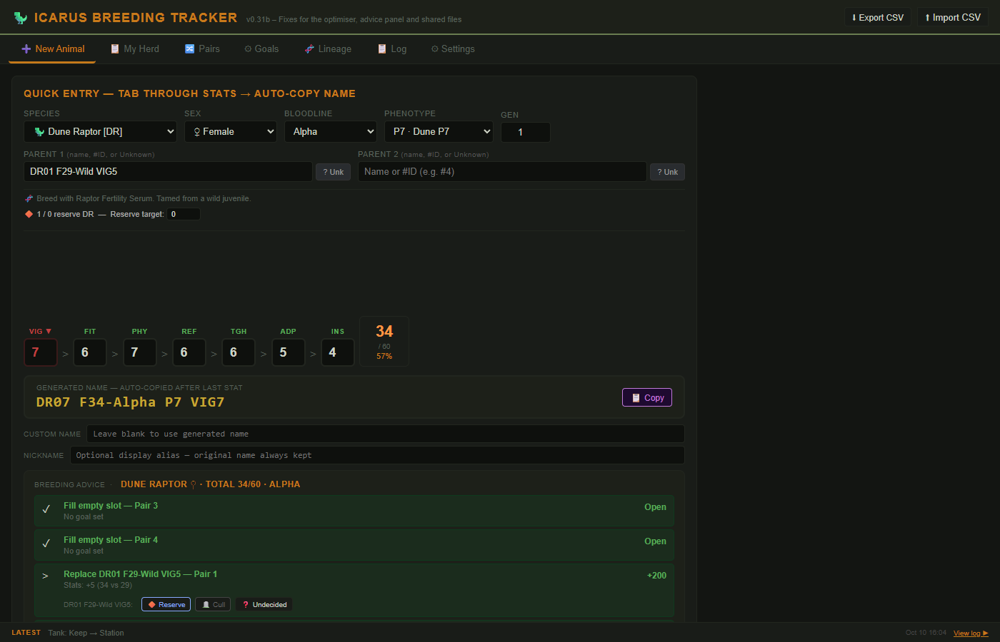
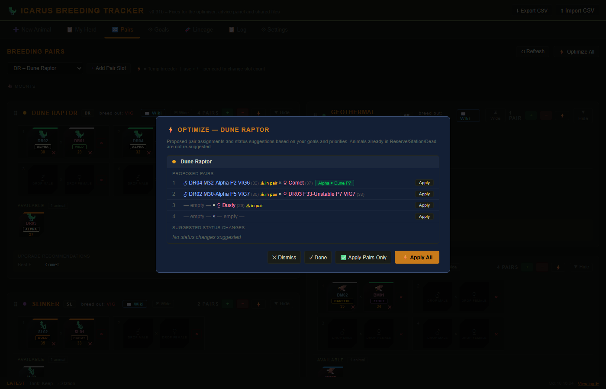
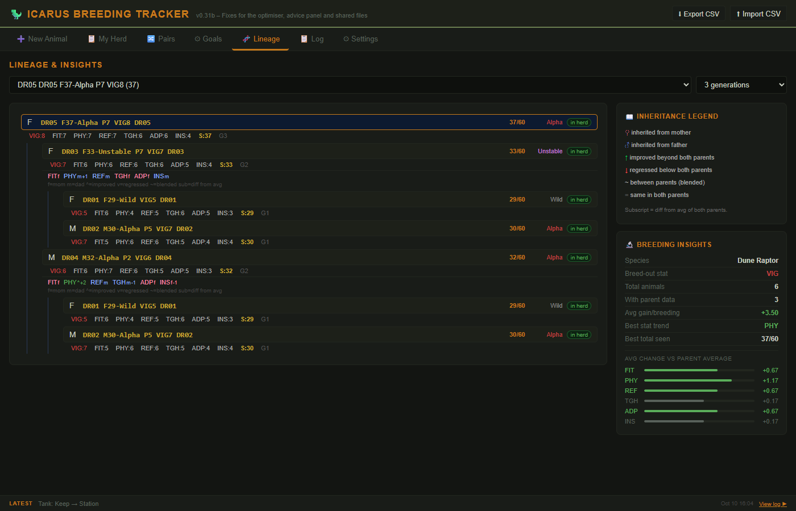
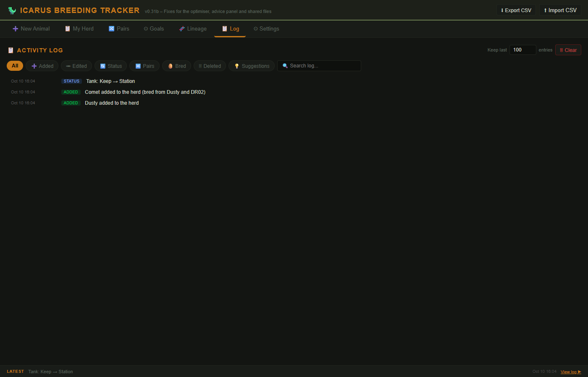
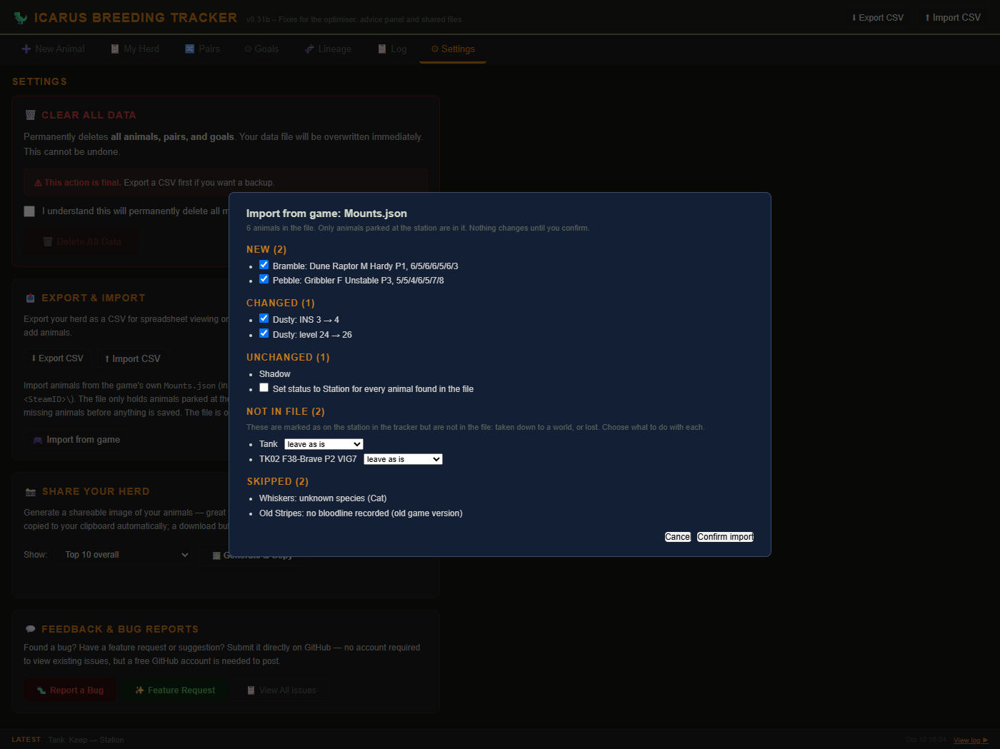
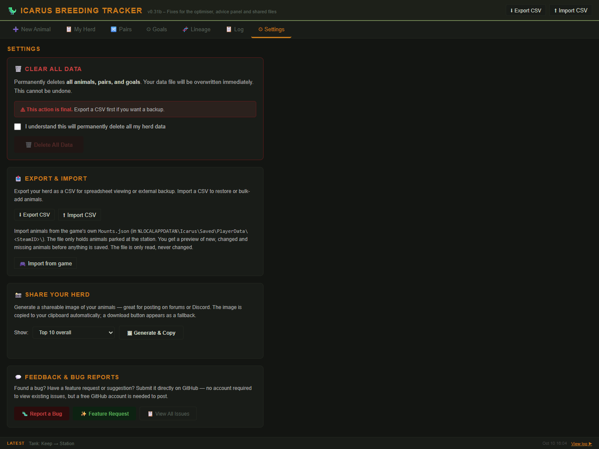

# 🦖 Icarus Breeding Tracker


[](https://ko-fi.com/H2H01XD48Q)

A free, open-source herd tracker and breeding planner for the survival game [Icarus by RocketWerkz](https://store.steampowered.com/app/1149460/Icarus/). Track your tamed animals, plan breeding pairs, work towards bloodline and phenotype goals, and keep the full lineage of every animal. One HTML file, no install, no account, no internet needed after the first load.

> **Keywords:** Icarus game animal breeding, Icarus taming tracker, Dune Raptor breeding, Slinker breeding, Icarus herd management, Icarus bloodline tracker, Icarus phenotype guide, RocketWerkz Icarus tool


---

## Contents

- [Use the web version](#-use-the-web-version)
- [Two minutes to your first pair](#-two-minutes-to-your-first-pair)
- [Where your data lives](#-where-your-data-lives)
- [How to use](#-how-to-use): [New Animal](#new-animal) · [My Herd](#my-herd) · [Animal Viewer](#animal-viewer) · [Breeding Pairs](#breeding-pairs) · [Goals](#goals) · [Lineage](#lineage) · [Log](#log) · [Import from game](#import-from-game) · [Settings](#settings)
- [Glossary](#-glossary)
- [FAQ and troubleshooting](#-faq-and-troubleshooting)
- [Status reference](#-status-reference)
- [Species reference](#-species-reference)
- [Download and run locally](#-alternative-download-and-run-locally)
- [Feedback and bug reports](#-feedback--bug-reports)
- [Contributing](#-contributing) · [License](#-license)

---

## 🌐 Use the Web Version

The easiest way to use the app is directly in your browser, nothing to download or update:

**https://joakim-fjeldstad.github.io/icarus-breeding-tracker**

The web version is always the latest release. Your data is saved to a JSON file on your own computer through the File System Access API; nothing is sent to any server.

> **Browser requirement:** Chrome or Edge (version 86 or newer). Firefox and Safari do not support the File System Access API. The app still works there with browser storage as a fallback, but saving to a file of your own needs Chrome or Edge.

Prefer a local copy for offline use or a specific version? See [alternative installation options](#-alternative-download-and-run-locally) at the bottom of this page.

---

## 🚀 Two minutes to your first pair

1. **Open the app** in Chrome or Edge. The startup screen asks how to store your data. Click **✨ Start fresh (create new file)**, pick any folder and save as `herd_data.json`. On later visits click **▶ Continue with herd_data.json** and grant permission once.
2. **Add two animals.** In **➕ New Animal**, pick the species, sex, bloodline and phenotype, type the seven stats you see on the animal in game, and save. The app generates a name such as `DR01 29F-Wild VIG5` and gives the animal an ID. Do this for a male and a female of the same species.

   

3. **Make them a pair.** Open **🔀 Pairs** and drag the two tiles from the pool into the male and female slots of pair 1. Their status becomes **Breed**.
4. **Set a goal.** In **⚙ Goals**, pick the species card, add a goal (for example bloodline Alpha, phenotype P7) and star the bloodlines and phenotypes you want. The **Breeding Suggestions** panel now tells you which animals to pair and which to hold back.
5. **Record the offspring.** When the two breed, add the juvenile with its parents filled in (type the ID, for example `DR01`). The **🧬 Lineage** tab shows the family tree and which stats improved.

Already have animals parked at the station? [Import them from the game](#import-from-game) instead of typing them.

---

## 💾 Where your data lives

- **Your herd file.** Everything you enter is saved to `herd_data.json` in the folder you chose. The app saves automatically after every change; a small **💾 Saved** indicator appears in the top right. Back it up, copy it to another computer or share it with another player like any file.
- **Browser storage.** If you skip the file (or use Firefox or Safari), the app keeps the data in the browser's own storage instead. Clearing site data deletes it, so export a CSV now and then.
- **The game's own file.** The import reads `Mounts.json` from the game's save folder. The tracker only reads it: it never changes, writes or exports game files, and it is not a save editor.
- **Nothing leaves your computer.** No account, no telemetry, no requests to any server. The web version is a static page on GitHub Pages.

> Keep `herd_data.json` on a local drive. Cloud-synced folders such as OneDrive or Google Drive can occasionally conflict with auto-save.

### Migrating from an older version

If you used the app when it stored data in the browser, click **⬆ Migrate data from browser storage** on the startup screen. Your data is written to the file and the old browser storage is cleared.

---

## 📖 How to Use

<details>
<summary id="new-animal"><strong>➕ New Animal</strong></summary>


Fill in the species, sex, bloodline, phenotype, generation, stats (VIG, FIT, PHY, REF, TGH, ADP, INS) and, if the animal was bred, the parents. The app generates a name automatically in the format `DR01 55F-Bold P3 VIG2` (see the [glossary](#-glossary) for how to read it). Hover over any stat label or column header to see what the stat does.

Below the species the form shows how that species is obtained in game (tamed from a wild juvenile, caught with a Snare Trap and a named bait, bought from the station, or a mission reward) and, for breedable species, which fertility serum to use.

A **live radar chart** updates as you fill in stats, giving an instant picture of the animal's profile before saving.


Two optional name fields: **Custom name** replaces the generated name entirely (useful for re-adding a deleted animal at its original ID), and **Nickname** sets a display alias shown throughout the app while the generated name stays for matching.

After saving, a **Place in Breeding Pair** panel offers to slot the animal directly into a pair. The app scores all available slots and highlights the best one. If a slot already has an occupant, you choose what happens to the displaced animal.

</details>

<details>
<summary id="my-herd"><strong>📋 My Herd</strong></summary>


All your animals in a sortable, filterable table:

- **Sort** by any column: click a header once to sort, again to reverse
- **Filter** by category, species, status, sex, bloodline, phenotype and minimum total score
- **Search** by name, nickname or ID (for example `DR123` or `wild vig4`); every word must match, and an active search includes Dead and Station animals
- **Change status inline** with the dropdown in each row
- **Edit** an animal with the edit button; **Cancel** leaves the form without saving
- **⭐ Favorite** marks an animal the optimiser must never suggest for culling
- **Nicknames** are shown in bold with the generated name dimmed beside them
- **Click any row** to open the [Animal Viewer](#animal-viewer)
- **🪦 Show Dead** and **🛸 Show Station** include those animals in the view; the **Station** and **Dead** status pills show them even when the toggles are off
- **⚡ Optimize Pairs** opens the pair optimiser for all species (see [Breeding Pairs](#breeding-pairs))

Two badges warn about data that needs attention: **unknown species** on an animal from a file made with another version of the tracker, and **duplicate ID** when two animals share an ID (older files can have this). Edit the animal to fix it.

</details>

<details>
<summary id="animal-viewer"><strong>🔍 Animal Viewer</strong></summary>


Clicking any animal row, tile or name anywhere in the app opens the **Animal Viewer**, a panel that slides in from the right without blocking the rest of the page. It shows:

- **Badge chips** for bloodline (in its colour), phenotype rarity, sex and generation
- **Radar chart** of all stat values
- **Full stats** with the breed-out stat highlighted
- **Current pair** and the optimiser's suggestion for this animal
- **Clickable parents** that open their own viewer when they are in your herd
- **Quick actions**: change status, assign to or remove from a pair slot, or jump to the edit form

Close the panel with **✕**, or open another animal to replace it.

</details>

<details>
<summary id="breeding-pairs"><strong>🔀 Breeding Pairs</strong></summary>


Set up your active breeding pairs per species. An animal can be in only one pair slot at a time.

Each pair has two **tile slots** styled after the in-game item slots, male ♂ and female ♀. Below the slots, the **animal pool** shows every unassigned animal of that species as a draggable tile. Each tile shows the animal's short ID (for example `DR02`), a coloured bloodline badge and a phenotype rarity stripe along the top (grey base, green uncommon, blue rare, orange legendary).

**Assigning animals**

- **Drag from the pool** into a male or female slot
- **Drag between slots**, also across pairs
- **✕** on an assigned tile returns the animal to the pool
- **Click any tile** to open the viewer

When placed in a slot the animal's status becomes **Breed**. When removed, it goes back to **Undecided** unless you had set something else on purpose (Reserve, Station and so on), which is kept.

Each slot shows a goal badge: **✓ Goal N** when the animal matches a species goal, **⚠ bloodline** when it carries a negatively starred trait, or **★★ Bold** when it has a positively starred trait without matching a goal.

An **upgrade recommendation** panel below each species card names free animals that would improve the weakest slot, or says **no upgrade**.

Cards collapse to compact chips with **▼ Hide / ▶ Show** and switch between Narrow and Wide. The grid is a masonry layout, and collapsed state and card width persist.

**⚡ Optimize Pairs** is in the section header (all species) and as a ⚡ button on each card (one species). The optimiser scores all active animals against your goals, bloodline priorities and phenotype priorities, then proposes the best male and female for each slot: goals first (one pair per goal where possible), then the highest-scoring remaining animals, with a bias towards bloodline diversity so separate lines are kept. Alongside it lists suggested status changes for unassigned animals: Reserve for desired traits with low stats, Station for high-stat animals that do not fit, Cull for negative traits or no valued traits below the stat goal, and Cull for animals outclassed by a paired animal of the same sex and species (unless they are within 10 % of the species maximum). Favourited animals are never suggested for culling. Choose **Apply Pairs Only** or **Apply All**.



If a proposed animal is in another pair slot, a **⚠ in pair** warning shows which pair it will leave.

</details>

<details>
<summary id="goals"><strong>⚙ Goals</strong></summary>


Per-species configuration. Each card and each section inside it collapses independently, and that state persists.

**Breed-out stat**: the stat you breed towards 0; it is left out of the total score and the animal name. Default VIG. For animals that cannot be ridden or do not produce resources, consider INS.

**Species goals**: what you are trying to produce, as a bloodline × phenotype target (either side can be "any"). Add as many as you like; the Breeding Suggestions panel recommends a pair for each.

**Phenotype priority** and **Bloodline priority**: star each from −3 to +3. Gold stars mark traits to breed for; red stars mark traits to breed out, so carriers get ⚠ warnings in Pairs and the suggestions avoid pairing two carriers. Unstable defaults to ★★ because it raises the mutation chance.

**Phenotype sightings**: a P0 to P7 radar of every phenotype you have recorded, on a square-root scale so rare ones stay visible. **Bloodline sightings** lists every bloodline recorded with tamed (🌿) and bred (🧬) counts. Both include dead animals.

**Breeding suggestions**, generated from your priorities: pair recommendations per goal, priority animals not in pairs, negative-trait temp breeders (bad trait but stats at least 20 % above the best clean alternative), animals to consider reserving, goals already achieved, reserve upgrades, and a diversity warning when all pairs share a bloodline on one side. Every animal named is clickable.

**Reserve target**: use **−** and **+** to set how many reserve animals you want per species.

</details>

<details>
<summary id="lineage"><strong>🧬 Lineage</strong></summary>



Select an animal to see its family tree, 2 to 4 generations deep or the whole tree. Each node shows stats, bloodline, generation and inheritance marks: whether each stat came from the mother or the father, improved beyond both parents or fell below them.

The sidebar shows species insights: average stat gain per breeding, the best performing stat, and the average change of every stat against the parents' average.

</details>

<details>
<summary id="log"><strong>📋 Log</strong></summary>



A banner at the bottom of the page always shows the latest activity. The **📋 Log** tab keeps the history: animals added or edited, status changes, pair changes, deletions, accepted suggestions and imports. Entries are timestamped and colour-coded, and animal names open the viewer.

Filter by type or by text, set the maximum number of entries (default 100, older entries are trimmed), or clear the log.

</details>

<details>
<summary id="import-from-game"><strong>🎮 Import from game</strong></summary>

Icarus keeps every animal parked at the station in a file on your computer:

```
%LOCALAPPDATA%\Icarus\Saved\PlayerData\<SteamID>\Mounts.json
```

Under **⚙ Settings → Export & Import**, click **🎮 Import from game** and pick that file. In the Windows file dialog you can paste `%LOCALAPPDATA%\Icarus\Saved\PlayerData` into the address bar to jump straight to the folder. The tracker reads the file and shows a preview before anything is saved:



- **New**: animals in the file that the tracker does not know. They get a tracker name, the in-game name as nickname, status **🛸 On Station**, and their stats, sex, bloodline, phenotype, parents and level from the game
- **Changed**: animals the tracker already has where a field differs, for example a typing error in a stat. Each field is listed with the old and the new value and can be unticked to keep the tracker's value
- **Unchanged**: animals that match exactly
- **Not in file**: animals marked as on the station in the tracker that are not in the file, because they were taken down to a world or lost. Leave them, or set their status to `?` or Dead
- **Skipped**: entries the tracker cannot use, with the reason (Cat and Dog, a record without a bloodline from an old game version, a newer save format)

How animals are recognised: an animal whose in-game name starts with its tracker ID (for example `DR12`) is that animal. Animals imported earlier are recognised by their in-game name (the nickname), as long as it is unique within the species. Entries that could not be read are not reported as missing. Importing the same file twice adds nothing.

Good to know:

- Only animals **parked at the station** are in the file. Animals out on a prospect are not
- The file is **only read**. The tracker never changes, writes or exports game files
- Your Steam ID and player name are in the file; the tracker skips them without reading them and never stores them
- The file does not say which animals were tamed and which were bred; an animal with parent names in the file is marked as bred

</details>

<details>
<summary id="settings"><strong>⚙ Settings</strong></summary>



- **Export CSV** writes the herd as a spreadsheet file; **Import CSV** restores or bulk-adds animals. Importing your own export again adds nothing. Rows with an unknown species or bloodline are ignored and counted
- **Import from game**, see above
- **Share your herd** renders an image of your animals (top 10 overall, the best of each species, or all active animals) and copies it to the clipboard, with a download button as fallback
- **Delete all data** clears the herd and pairs after a confirmation. Export a CSV first
- Links to report a bug, request a feature or view all issues on GitHub

</details>

---

## 📚 Glossary

| Term | Meaning |
|---|---|
| **Stats** | The seven genetic values of an animal, 0 to 10 each: VIG (Vitality), FIT (Endurance), PHY (Muscle), REF (Agility), TGH (Toughness), ADP (Hardiness), INS (Utility). In game they are called by the names in brackets. |
| **Total** | The sum of the six stats that are not the breed-out stat, out of 60. The percentage in My Herd is total over the species maximum. |
| **Breed-out stat** | The one stat per species you want at 0, so it is left out of the total and the name. Default VIG; set per species in Goals. |
| **Bloodline** | One of the game's twelve lineages (Wild, Brave, Careful, Timid, Bold, Hardy, Stout, Ambitious, Resolute, Unstable, Savage, Alpha). Each gives fixed and growing modifiers; Unstable raises the mutation chance when breeding. |
| **Phenotype** | The coat variant: base (P0) and up to seven numbered variants per species, with rarities from the game data (base, uncommon, rare, legendary). |
| **Generation** | 1 for tamed animals, one more than the highest parent for bred ones. |
| **Status** | What you plan to do with the animal; see the [status reference](#-status-reference). |
| **Generated name** | `DR01 55F-Bold P3 VIG2` means: Dune Raptor number 1, total 55, female, bloodline Bold, phenotype P3, breed-out stat VIG at 2. The ID (`DR01`) is how you refer to the animal as a parent. |
| **Nickname** | A display alias. Names imported from the game land here. |
| **Pair slot** | One male and one female you are breeding together. The number of slots per species is yours to set. |

---

## ❓ FAQ and troubleshooting

**The startup screen offers no file option, or saving does not work.** You are probably in Firefox or Safari, which lack the File System Access API. Use Chrome or Edge for file saving; in other browsers the app keeps the data in browser storage.

**I opened the app and my herd is gone.** Check that you clicked **▶ Continue with herd_data.json** and granted permission. If you opened the file from a different folder or a cloud-synced copy, point the app at the right file. Browser storage data disappears when site data is cleared; a CSV export is your backup.

**How do I move to another computer?** Copy `herd_data.json` and open it from the startup screen on the other machine, or export a CSV and import it there.

**The import does not recognise my animals.** The tracker matches on its own ID at the start of the in-game name (`DR12 ...`) or on the nickname. If you named animals differently in game, they are listed as new; the preview shows "may already be in the herd as ..." when an animal with the same stats exists, so you can untick it and rename either side.

**What does "Not in file" mean?** The game file only lists animals parked at the station. An animal the tracker has as **🛸 On Station** that is not in the file was taken down to a world or is gone. The preview lets you decide per animal.

**Some animals vanished from Goals.** The suggestions and pair recommendations only consider animals that are not Dead or On Station, while the sighting charts count every animal ever recorded. Use the status pills in My Herd to see everything. If a card shows an error instead of its content, the file has a malformed entry for that species; the other cards still render.

**An animal shows "duplicate ID" or "unknown species".** Older files can hold two animals with the same ID, and a file from another version can name a species this version lacks. Edit the animal: give it a custom name with a free ID, or correct the species.

**Can the tracker change my game saves?** No. It only reads `Mounts.json` through a file you pick, and it has no code path that writes game files.

---

## 🐾 Status Reference

| Icon | Status | Meaning |
|---|---|---|
| ❓ | Undecided | Newly added, not yet assessed |
| ✅ | Keep | Good animal, part of the herd long-term |
| 🐣 | Breed | Active breeder |
| ⚡ | Temp Breed | Temporary breeder: wrong bloodline but used for a stat boost |
| 🔶 | Reserve | Held in reserve, not currently active |
| 🛸 | On Station | Stored on the space station (transit between maps or safe storage) |
| 🗑️ | Discard | Scheduled for removal |
| 🪦 | Dead/Culled | Deceased, hidden by default, kept in records |

---

## 🧬 Species Reference

All 26 species the tracker knows, with how the first animals are obtained and which fertility serum breeds them. Breeding needs the serum crafted at the Ranching Station; species without one cannot be bred and show no parent fields in the New Animal form.

| ID | Species | Category | How obtained | Breeding |
|---|---|---|---|---|
| DR | Dune Raptor | Mount | Wild juvenile | Raptor Fertility Serum |
| GR | Geothermal Raptor | Mount | Wild juvenile | Raptor Fertility Serum |
| BM | Moa | Mount | Wild juvenile | Moa Fertility Serum |
| SL | Slinker | Mount | Wild juvenile | Slinker Fertility Serum |
| BF | Buffalo | Mount | Wild juvenile | Buffalo Fertility Serum |
| AM | Arctic Moa | Mount | Wild juvenile | Moa Fertility Serum |
| DV | Draven | Mount | Wild juvenile | Not breedable |
| HR | Horse | Mount | Station | Not breedable |
| TE | Terrenus | Mount | Wild juvenile | Not breedable |
| TK | Tusker | Mount | Wild juvenile | Tusker Fertility Serum |
| UB | Ubis | Mount | Wild juvenile | Ubis Fertility Serum |
| WM | Woolly Mammoth | Mount | Wild juvenile | Not breedable |
| ZB | Zebra | Mount | Mission reward | Not breedable |
| SZ | Shaggy Zebra | Mount | Wild juvenile | Not breedable |
| GB | Gribbler | Attack Pet | Snare: Gribbler Bait (Tundra) | Gribber Fertility Serum (the game's spelling) |
| HY | Hyena | Attack Pet | Snare: Hyena Bait (Desert, Volcanic) | Not breedable |
| KW | Kiwi | Attack Pet | Snare: Kiwi Bait (Forest, Grassland, Arctic, at night) | Not breedable |
| SK | Skulk | Attack Pet | Snare: Skulk Bait (Tundra, Arctic) | Not breedable |
| SW | Snow Wolf | Attack Pet | Snare: Wolf Bait (Arctic) | Wolf Fertility Serum |
| WB | Wild Boar | Attack Pet | Snare: Wild Boar Bait (Forest, Grassland) | Boar Fertility Serum |
| WO | Forest Wolf | Attack Pet | Snare: Wolf Bait (Forest, Grassland) | Wolf Fertility Serum |
| SC | Storca | Attack Pet | Snare: Storca Bait (Tundra, Arctic) | Not breedable |
| CT | Cattle (Cow / Bull) | Utility Pet | Station | Bull Fertility Serum |
| CK | Chicken (Rooster) | Utility Pet | Station | Rooster Fertility Serum |
| SH | Sheep (Ram) | Utility Pet | Station | Ram Fertility Serum |
| PG | Pig | Utility Pet | Station | Pig Fertility Serum |

Sources: the game's own data tables, the official patch notes and the [Icarus wiki](https://icarus.wiki.gg/). Cat, Dog, Blueback and Redback are left out on purpose: they cannot be bred, or cannot be obtained.

---

## 💾 Alternative: Download and Run Locally

If you prefer to keep a local copy (useful for offline play or a specific version):

### Option A: download the file directly

1. Go to the [repository on GitHub](https://github.com/joakim-fjeldstad/icarus-breeding-tracker)
2. Click `index.html` in the file list
3. Click the **download icon (⬇)** in the top right of the file view
4. Save it to a permanent local folder, for example a folder in your Documents
5. Open it in Chrome or Edge

Every released version is also available under **Tags** on GitHub.

### Option B: clone with Git

```
git clone https://github.com/joakim-fjeldstad/icarus-breeding-tracker.git
```

Pull updates with `git pull` whenever a new version is released.

---

## 💬 Feedback & Bug Reports

Use the **⚙ Settings** tab inside the app for direct links to submit bug reports and feature requests on GitHub. A free GitHub account is required to post, but anyone can view existing issues.

Direct links:
- 🐛 [Report a Bug](https://github.com/joakim-fjeldstad/icarus-breeding-tracker/issues/new?labels=bug)
- ✨ [Feature Request](https://github.com/joakim-fjeldstad/icarus-breeding-tracker/issues/new?labels=enhancement)
- 📋 [View All Issues](https://github.com/joakim-fjeldstad/icarus-breeding-tracker/issues)

Found a security problem? Please don't post it in a public issue. Use **Report a vulnerability** on the repository's [Security tab](https://github.com/joakim-fjeldstad/icarus-breeding-tracker/security).

---

## 🤝 Contributing

Bug reports, ideas and pull requests are welcome. [CONTRIBUTING.md](CONTRIBUTING.md) explains how the project is built (one file, no build step), how to run the headless smoke test (`node tools/smoke.mjs`), how to refresh the screenshots in this README (`node tools/screenshots.mjs`), and what a pull request needs.

## 📄 License

GPL-3.0, see [LICENSE](LICENSE). The game, its names and its data belong to RocketWerkz; this is an unofficial fan-made tool.
